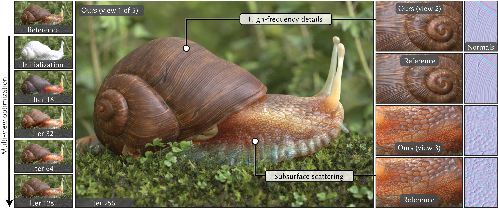

# Practical Inverse Rendering Of Textured And Translucent Appearance



Source code for the paper "Practical Inverse Rendering Of Textured And Translucent Appearance" by [Philippe Weier](https://weiphil.github.io/portfolio/), Jérémy Riviere, Ruslan Guseinov, Stephan Garbin, Philipp Slusallek, Bernd Bickel, Thabo Beeler and Delio Vicini at SIGGRAPH 2025.

You can find the original paper and supplemental material on the [project webpage](https://weiphil.github.io/portfolio/practical_reconstruction).

## Pre-requisites

Our python source code is based on [Mitsuba](https://github.com/mitsuba-renderer/mitsuba3) and [DrJit](https://github.com/mitsuba-renderer/drjit).
All the python package requirements can be installed into (ideally in a new python environment) with:
```bash
python install -r requirements.txt
```
You will also need an installation of [ffmpeg](https://ffmpeg.org/) to save optimization videos and [flip](https://github.com/NVlabs/flip) (C++ build) to compute FLIP error metrics. Make sure to set `FLIP_EXECUTABLE` in `python/practical_reconstruction/figutils.py` according to your installation directory.

We tested our implementation with the following configuration:

Windows and Linux:
- Python 3.10.10
- Cuda 12.0
- Nvidia Driver 576.40
- RTX 4090

MacOS (without GPU support) was not explicitely tested but should work too with minor adjustments.

## Project structure

The python source code is divided in three main folders :

- `python/core/` all Mitsuba plugins as well as some utilities.
- `python/practical_reconstruction/` code for the main optimization pipeline.
- `python/variables/` various optimization variables to simplify the optimization pipeline

We provide some of our scenes in `third_party/`. The `statue` and `wicker_basket` scenes can be downloaded [here](https://oc.cs.uni-saarland.de/index.php/s/8tw83k7QAaXDKcb). Their respective configurations can be found in `scenes/scene_configs` and `scenes/sss_scene_configs` whether they require subsurface scattering or not.

Finally `figures/` contains python notebooks to reproduce many figures from our paper. The notebooks are a great starting point for anybody who wants to get more familiar with our codebase.

Anybody interested in the details of our Laplacian mipmapping should check out the following files:

- `python/core/pyramid.py`
- `python/core/textures/mipmap_flat.py`
- `python/variables/flatmip_aware_pyramid.py`

For more details on our specialized differentiable subsurface path tracing check out:

- `python/core/integrators/prb_path_volume.py`
- `python/core/integrators/volume_utils.py`

## Usage

Simply open and run one of the notebooks present in `figures/` to get started. Temporary results (e.g. ongoing optimization steps) will be stored in `tmp/` while final results will be stored in `results/` (these folders are created automatically). In addition to the individual results, each figure script produces a pdf that will be stored in `figures/pdfs` at the end of the execution.

## Citation

```bibtex
@article{Weier2025PracticalInverse,
  title   = {Practical Inverse Rendering of Textured and Translucent Appearance},
  author  = {Philippe Weier and J\\'{e}r\\'{e}my Riviere and Ruslan Guseinov and Stephan Garbin and Philipp Slusallek and Bernd Bickel and Thabo Beeler and Delio Vicini},
  year    = 2025,
  month   = aug,
  journal = {Transactions on Graphics (Proceedings of SIGGRAPH)},
  volume  = 44,
  number  = 4,
  doi     = {10.1145/3730855}
}
```